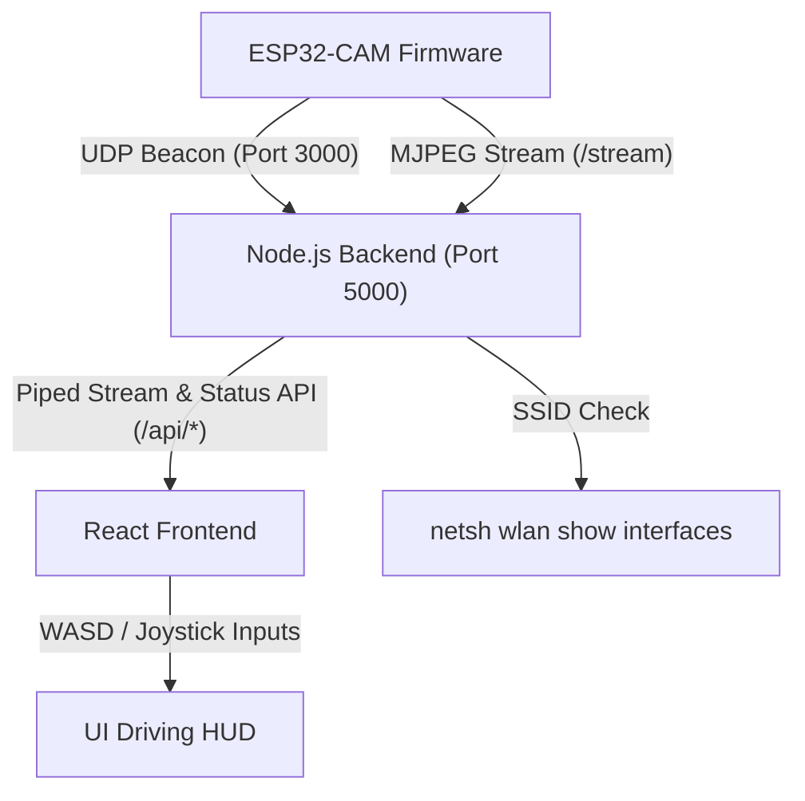

# ESP32-CAM Robot Tank Control Center

This repository contains the complete workspace for a secure, low-latency robot tank control center built around the ESP32-CAM hardware platform. It includes the embedded firmware, a local Node.js relay proxy, and a futuristic React dashboard.

---

## Architecture Diagram



---

## Features

### 1. Zero-Configuration UDP Auto-Discovery
To avoid hardcoding the ESP32-CAM IP address in the server configuration, the firmware broadcasts a JSON packet on UDP port 3000 every 2 seconds. The Node.js server listens to these beacons and automatically binds the proxy targets.

### 2. Dual Wi-Fi Client Failover
The ESP32-CAM is programmed to establish client connections sequentially:
- First, it attempts connection to `SSID: Pumpkinpie` (password: `dobbyaspenindy`).
- If unsuccessful within 10 seconds, it falls back to `SSID: Dobby` (password: `sanmina-1`).
- If both fail, it continues to cycle and output diagnostics to the serial interface (`COM5` / `115200` baud).

### 3. Dual-Verification Network Security Lockout
The entire system operates strictly on the two verified SSIDs. Both nodes perform checks:
- **Firmware**: Checks its current SSID. If not on `Pumpkinpie` or `Dobby`, it rejects `/stream` and `/control` requests with HTTP 403.
- **Node.js Server**: Checks the host PC's Wi-Fi network signature using the Windows Shell (`netsh wlan show interfaces`). If it is not on a verified SSID (or disconnected from Wi-Fi), it blocks proxy streams and controls immediately, transmitting a lockout status.
- **React Frontend**: Overlays a striking alert screen reading **"Not on verified safe network"** when security triggers.

### 4. Camera Stream & Transport Optimizations
- **Double Buffering & High Frame Rate**: Configured PlatformIO build flags to utilize onboard PSRAM (`-DBOARD_HAS_PSRAM` and `-mfix-esp32-psram-cache-issue`). When external memory is detected, the module enables double buffering (`fb_count = 2`) and high-clarity JPEG compression (`jpeg_quality = 10`) at QVGA resolution.
- **TCP setNoDelay Socket Tuning**: Disabled Nagle's algorithm on the proxy backend (`socket.setNoDelay(true)`) to prevent TCP grouping delays. Frames are pushed directly to the browser as soon as they are read, yielding the lowest possible driving latency.

### 5. Cockpit Drive Controller Dashboard
- **Live Video View**: Smoothly overlays status tags showing camera IP, RSSI information, and secure signature indicators.
- **Keyboard WASD HUD**: Intercepts local W, A, S, D keystrokes and lights up visual dashboard indicators.
- **Analog Virtual Joystick**: Features a custom-styled, draggable joystick that tracks displacements and snaps back to center on release.
- **Flash Light Switch**: Exposes a toggle button linked to the ESP32-CAM's onboard high-power flash LED (GPIO 4) to light up dark routes.

---

## Project Structure

- `platformio.ini`: PlatformIO hardware definitions (COM5 upload settings).
- `src/main.cpp`: ESP32-CAM C++ firmware.
- `server/`: Node.js Express proxy and UDP discovery daemon.
- `frontend/`: React + Vite single-page dashboard.

---

## Setup & Running Instructions

### A. Uploading Firmware (ESP32-CAM)
1. Mount the ESP32-CAM onto your programming jig (ensure GP0 is grounded to enter flash mode).
2. Connect the USB interface to your PC (mapped to `COM5` as configured in `platformio.ini`).
3. Flash using PlatformIO in VS Code, or run:
   ```bash
   # From root directory
   pio run --target upload
   ```
4. Disconnect GP0 from GND and reboot the module.

### B. Launching the Backend Server & Dashboard
1. Ensure your Host PC is connected to one of the verified Wi-Fi networks (`Pumpkinpie` or `Dobby`).
2. Move into the `server/` directory:
   ```bash
   cd server
   npm install
   npm start
   ```
3. Open a browser and navigate to: **`http://localhost:5000`**

---

## Regression Testing

A robust test suite is configured for the Node.js server. The suite mocks local network devices and command outputs to test:
- Block rules on unsecure SSIDs.
- Secure configurations.
- API validation responses.

Run backend tests using:
```bash
cd server
npm test
```
