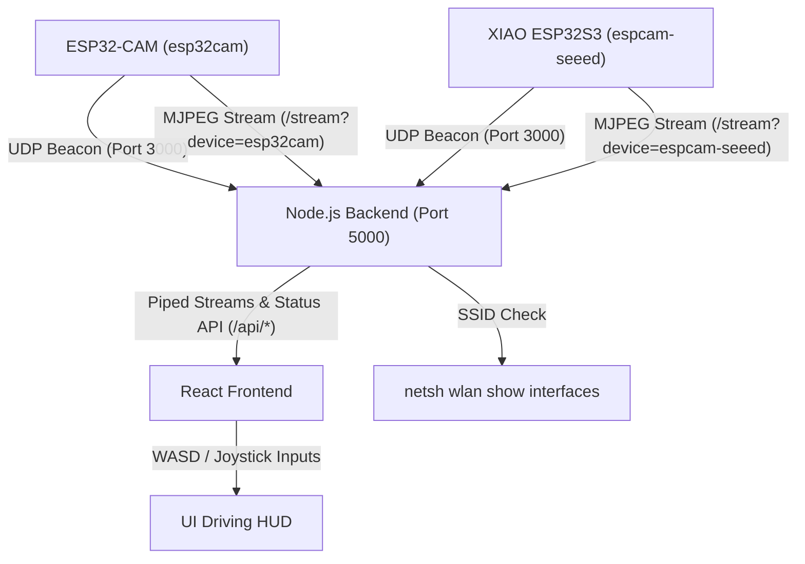

# ESP32-CAM Robot Tank Control Center

This repository contains the complete workspace for a secure, low-latency robot tank control center supporting **dual-camera feeds**:
1. **`esp32cam`**: The original AI-Thinker ESP32-CAM board (connected to `COM6`).
2. **`espcam-seeed`**: A Seeed Studio XIAO ESP32S3 Sense camera board (connected to `COM18`, with fallback mock stream support for XIAO ESP32C3).

The workspace includes embedded C++ firmware (PlatformIO), a local Node.js relay proxy, and a futuristic dual-feed React dashboard.

---

## Architecture Diagram



---

## Features

### 1. Zero-Configuration Multi-Device UDP Auto-Discovery
To avoid hardcoding IP addresses, each ESP32 board broadcasts a JSON packet on UDP port 3000 every 2 seconds. The packet contains the board's unique name (`esp32cam` or `espcam-seeed`), local IP, and SSID. The Node.js server listens to these beacons and registers/tracks each device dynamically.

### 2. Dual Wi-Fi Client Connection & AP Suppress
Both cameras are programmed to connect client-side only:
- First, it attempts connection to `SSID: Pumpkinpie` (password: `dobbyaspenindy`).
- If unsuccessful within 10 seconds, it falls back to `SSID: Dobby` (password: `sanmina-1`).
- **AP Mode Suppressed**: Sets `WiFi.mode(WIFI_STA)` at startup to prevent the ESP32 from running its own Access Point and broadcasting an SSID.
- They output serial diagnostics at `115200` baud.

### 3. Dual-Verification Network Security Lockout
The entire system operates strictly on the two verified SSIDs. Both nodes perform checks:
- **Firmware**: Checks its current SSID. If not on `Pumpkinpie` or `Dobby`, it rejects stream and control requests with HTTP 403.
- **Node.js Server**: Checks the host PC's Wi-Fi network signature using `netsh wlan show interfaces`. If not on a verified SSID, it blocks proxy streams and controls immediately, transmitting a lockout status.
- **React Frontend**: Overlays a lockout alert screen reading **"Not on verified safe network"** when security triggers.

### 4. Low-Latency Camera Stream & Socket Tuning
- **Double Buffering & High Frame Rate**: Configured PlatformIO build flags to utilize PSRAM. When memory is detected, the module enables double buffering (`fb_count = 2`) and high-clarity JPEG compression (`jpeg_quality = 10`) at QVGA resolution.
- **Mock Camera Fallback**: If using a XIAO ESP32C3 (which lacks camera pins), a mock stream handler feeds a valid static JPEG to test Wi-Fi connectivity and backend integration.
- **TCP setNoDelay Socket Tuning**: Disabled Nagle's algorithm on the proxy backend (`socket.setNoDelay(true)`) to prevent TCP grouping delays. Frames are piped immediately to the browser for low driving latency.

### 5. Multi-Feed Cockpit Dashboard
- **Dual Live Feeds**: Displays both feeds side-by-side (collapsing to stacked vertically on narrow screens) with individual network statistics.
- **HUD Telemetry Status**: Displays host security status and link/IP statuses for both active cameras.
- **Self-Contained Flash Toggles**: Allows toggling the flash light or user status LED individually for each camera feed card.
- **Keyboard WASD HUD & Analog Joystick**: A global controller HUD that visualizes keystrokes and displacement inputs to drive the robot tank.

---

## Project Structure

- `platformio.ini`: PlatformIO hardware definitions (`esp32cam` on COM6, `espcam-seeed` on COM18).
- `src/main.cpp`: ESP32 C++ firmware (handles both AI-Thinker and Seeed Studio board pin layouts).
- `server/`: Node.js Express proxy and UDP discovery daemon.
- `frontend/`: React + Vite single-page console dashboard.

---

## Setup & Running Instructions

### A. Uploading Firmware (ESP32)

1. Select your target environment in PlatformIO or flash via terminal:
   ```bash
   # Upload to the AI-Thinker ESP32-CAM (COM6)
   pio run -e esp32cam --target upload

   # Upload to the Seeed Studio XIAO ESP32S3 (COM18)
   pio run -e espcam-seeed --target upload
   ```
2. Reboot the module to begin broadcasting UDP beacons.

### B. Launching the Backend Server & Dashboard

1. Ensure your Host PC is connected to `Pumpkinpie` or `Dobby`.
2. Move into the `server/` directory:
   ```bash
   cd server
   npm install
   npm start
   ```
3. Open a browser and navigate to: **`http://localhost:5000`**

---

## Regression Testing

Run backend tests using:
```bash
cd server
npm test
```
