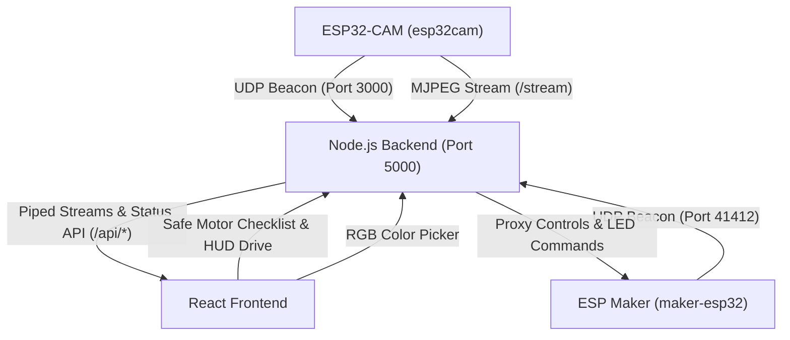

# ESP32-CAM & ESP Maker Robot Tank Cockpit

This repository contains the complete workspace for a secure, low-latency robot tank control center. It coordinates:
1. **`esp32cam`**: The AI-Thinker ESP32-CAM board (connected to `COM6`) providing live video stream.
2. **`espcam-seeed`**: A Seeed Studio XIAO ESP32S3 Sense camera board (connected to `COM18`, with fallback mock stream support) as an alternative/secondary video feed.
3. **`maker-esp32`**: The main robot actuator controller running on the **ESP Maker (esp-maker-usba-4motor)** board. It drives the tank's motors, displays telemetry on its OLED screen, and controls RGB NeoPixel lights.

The workspace includes embedded C++ firmware (PlatformIO), a local Node.js relay proxy server, and a futuristic, glassmorphic React dashboard cockpit.

---

## Architecture Diagram



---

## Features

### 1. Zero-Configuration UDP Auto-Discovery
To avoid hardcoding IP addresses across devices:
- Camera boards (`esp32cam` / `espcam-seeed`) broadcast JSON discovery packets on UDP port `3000` every 2 seconds.
- The **ESP Maker Board** (`maker-esp32`) broadcasts discovery beacons on UDP port `41412` every 3 seconds.
- The Node.js server listens to these beacons, dynamically registering device IPs (`10.0.0.58`, etc.) for seamless connection.

### 2. Dual Wi-Fi Client Connection & AP Suppress
All boards are configured client-side only to stay secure:
- They attempt connection to `SSID: Pumpkinpie` (password: `dobbyaspenindy`).
- If unsuccessful, they fallback to `SSID: Dobby` (password: `sanmina-1`).
- Access Point (AP) mode is disabled (`WiFi.mode(WIFI_STA)`) on all devices to suppress open SSID broadcasts.

### 3. Dual-Verification Network Security Lockout
The entire system operates strictly on verified SSIDs. Both nodes perform checks:
- **Firmware**: Checks its current SSID. If not on `Pumpkinpie` or `Dobby`, it rejects requests with HTTP 403.
- **Node.js Server**: Checks the host PC's Wi-Fi network signature using `netsh wlan show interfaces`. If not on a verified SSID, it blocks proxy streams and controls immediately, transmitting a lockout status.
- **React Frontend**: Overlays a lockout alert screen reading **"Not on verified safe network"** when security triggers.

### 4. ⚠️ Safe Motor Verification Control
To protect the tank and motor driver circuits from high current spikes:
- Before the main driving joystick/HUD unlocks, the operator must complete a 4-step motor direction verification flow.
- Direction tests send timed pulses to each motor/direction.
- Operators must check "Pass" for all 4 tests before the Main Drive HUD becomes interactive.

### 5. RGB NeoPixel Studio
- The cockpit features a full dynamic color picker for the tank's NeoPixels.
- Select target LEDs (`ALL`, `L0`, `L1`, `L2`, `L3`) and control color sweeps or specific custom hex codes.

---

## Project Structure

- `espcam-tankcam/src/main.cpp`: ESP32-CAM firmware (handles stream, flash control, and UDP discovery beacons).
- `espcam-tankcam/platformio.ini`: PlatformIO hardware definitions for camera environments.
- `esp-maker-usba-4motor/`: Embedded firmware workspace for the main **ESP Maker Board** actuator controller.
- `server/`: Node.js Express proxy, UDP auto-discovery daemon, and static asset router.
- `frontend/`: React + Vite single-page cockpit dashboard console.

---

## Setup & Running Instructions

### A. Uploading Firmware (ESP32)

1. Select your target environment in PlatformIO or flash via terminal:
   ```bash
   # Upload to the ESP32-CAM (COM6)
   pio run -e esp32cam --target upload

   # Upload to the Seeed Studio XIAO ESP32S3 (COM18)
   pio run -e espcam-seeed --target upload
   ```
2. Navigate to `esp-maker-usba-4motor/` and flash the ESP Maker board:
   ```bash
   pio run --target upload
   ```

### B. Launching the Backend Server & Dashboard (Production Mode)

To run the unified server that handles the camera proxies and serves the React cockpit dashboard:

1. **Verify Network**: Ensure your Host PC is connected to one of the verified Wi-Fi networks (`Pumpkinpie` or `Dobby`).
2. **Navigate to the Server Directory**:
   ```bash
   cd server
   ```
3. **Install Dependencies**:
   ```bash
   npm install
   ```
4. **Start the Server**:
   ```bash
   npm start
   ```
   *This starts the backend server on HTTP port 5000, listens for discovery beacons, and hosts the React console UI.*
5. **Access the Cockpit**: Open your web browser and go to: **`http://localhost:5000`**

### C. Running in Development Mode (Optional)

If you are modifying the frontend React code and want hot-reloading:

1. **Start the Backend**: Run `npm start` from within the `server/` directory.
2. **Start the Dev Server**: Open a second terminal window, navigate to `frontend/`, and run:
   ```bash
   npm run dev
   ```
3. **Access the Dev Console**: Open your web browser and go to: **`http://localhost:5173`** *(Vite will proxy API requests to the backend server running on port 5000)*.

---

## Regression Testing

Run backend tests using:
```bash
cd server
npm test
```
